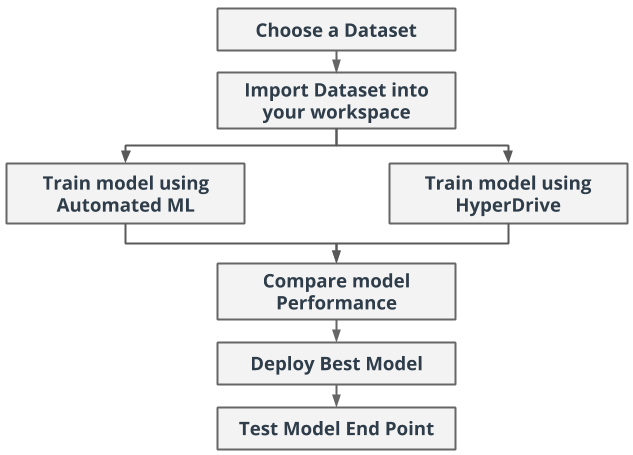
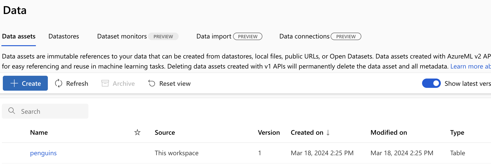
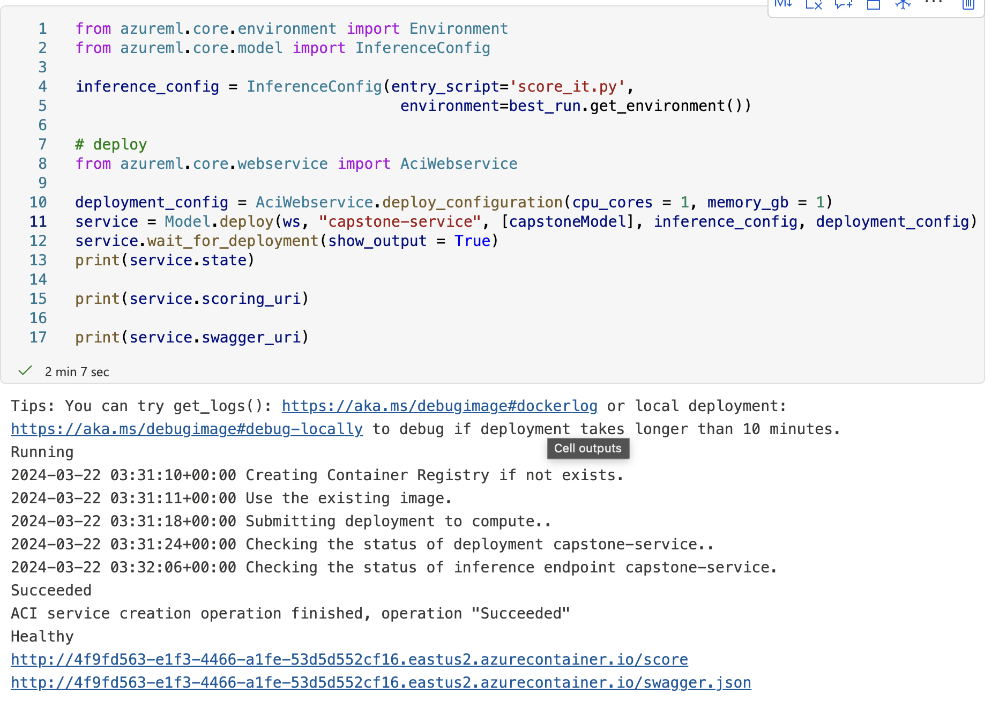
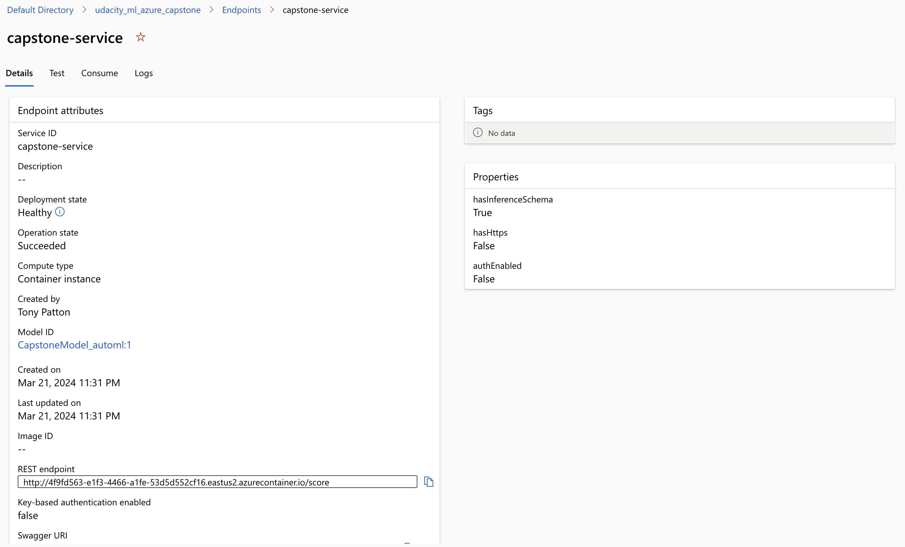
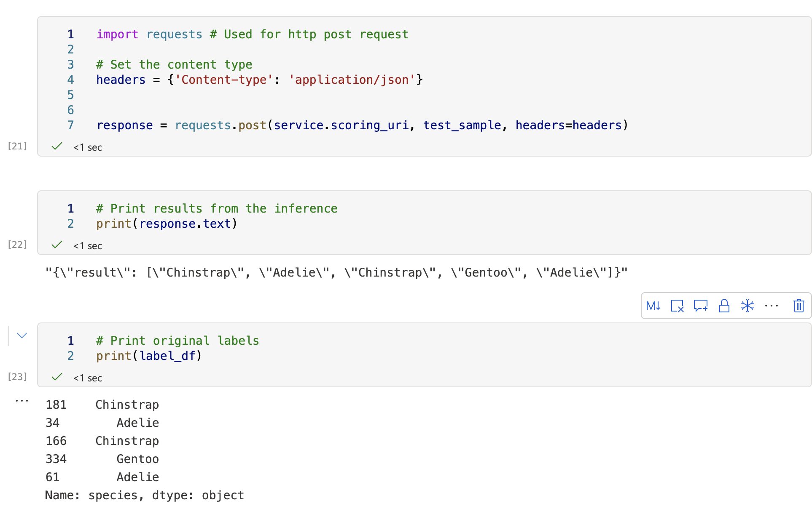
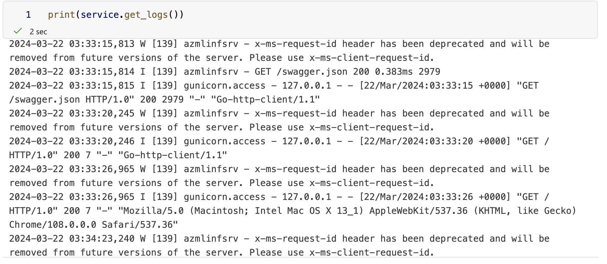
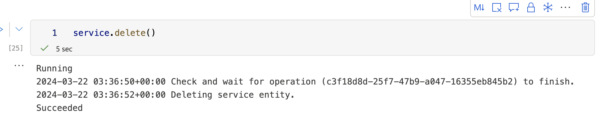

# Udacity ML Engineer with Microsoft Azure - Capstone Project

This is the Capstone project for the Udacity Course - ML Engineer with Microsoft Azure.

This project provides the opportunity to use the knowledge obtained from the course to solve an interesting problem. In this project, two models are created: one using AutoML plus one customized model whose hyperparameters are tuned using HyperDrive. The performance of both the models is compared/contrasted and best performing model is deployed. This project demonstrates the ability to use external datasets, train a model using different AzureML framework tools available as well as the ability to deploy the model as a web service.

Both Hyperdrive and AutoML API are used in this project.

### Problem Statement

In this project we attempt to solve the problem of classifying penguin species for a given input data. We first apply AutoML where multiple models are trained to fit the training data. Secondly, we use a LogicalRegression model while tuning hyperparameters using HyperDrive. Finally, the best model from the two approaches is chosen (in terms of accuracy) and deployed as a web service.

## Project Set Up and Installation

- Created new workspace called udacity-capstone
- Created new compute instance (DS-3) to be used by workspace/notebooks
- Forked nd00333-capstone project to my github from Udacity's instance
- Uploaded code from github.com/aspatton/nd00333-capstone repo to my workspace
- Imported all needed dependencies in the notebooks.
- Imported dataset in the workspace (penguins.csv)
- Train model using AutoML
- Train model using HyperDrive
- Compare model performance - AutoML vs HyperDrive
- Select the best performing model via the comparison
- Deploy the best performing model as a web service
- Test the model
- ** Added screenshots throughout the project **
- Editing/updated readme.md

## Dataset - penguins.csv

This project uses the Palmer Archipelago penguin data from Kaggle -> https://www.kaggle.com/datasets/parulpandey/palmer-archipelago-antarctica-penguin-data

### Overview

Palmer Archipelago (Antarctica) penguin data

Data collected and made available by Dr. Kristen Gorman and the Palmer Station, Antarctica LTER, a member of the Long Term Ecological Research Network.

The dataset contains the following columns:

- species: penguin species, the column to be predicted.
- island: The island where the penguin was found.
- culmen_length_mm: The length of the penguin's bill in millimeters.
- culmen_depth_mm: The depth of the penguin's bill in millimeters.
- flipper_length_mm: The length of the penguin's flipper in millimeters.
- body_mass_g: The penguins's body mass in grams.
- sex: Penguin's sex.

The distribution of data categories:

- species: There are 3 species of penguins in the dataset: Adelie (152), Gentoo (124), and Chinstrap (68).
- island: Penguins are from 3 islands: Biscoe (168), Dream (124), and Torgersen (52).
- sex: There are 168 male, 165 female, and 1 ambiguous gender.

### Access

A Dataset is uploaded from the external data source to Azure during creation.

- Storage URI: https://udacitymlazure9709269552.blob.core.windows.net/azureml-blobstore-93243a9c-157e-4332-ba0f-0b89d7f1f592/UI/2024-03-18_182505_UTC/penguins.csv

### Task

Our objective is to build prediction models that predict a penguin's species from the set of given penguin features.

## AutoML

Working with the AutoML run we specify the classification task, the primary metric of accuracy, training data set  along with target column name. Featurization is set to "auto", meaning that the featurization step should be done automatically. Early stopping is set to True to avoid overfitting, and debugging info is sent to local log file.

        automl_config = AutoMLConfig(compute_target=cpu_cluster,
                                     task = "classification",
                                     training_data=ds,
                                     label_column_name="species",   
                                     enable_early_stopping= True,
                                     featurization= 'auto',
                                     debug_log = "automl_errors.log",
                                     experiment_timeout_minutes=15,
                                     max_concurrent_iterations=4,
                                     primary_metric='accuracy'
                                    )

### Run Details

The next three screen show the job running and the details of the runs.

### Results

The following screen shows the code/model running.

Once the model is finished, the following screen shows the details of the run.

### Best AutoML Model

AutoML's best peforming model is VotingAlgorhthm with 0.82 Accuracy and 0.96 Weighted AUC.

The model was registered:

### For a complete code overview, we refer to the jypter notebook automl.ipynb.

## Hyperparameter Tuning

We will compare the above automl run with a tradional ML approach via LogicalRegression, and Hypeparameters tuned via HyperDrive.

These parameters used:

        param_sampling = RandomParameterSampling({
            '--C': choice(0.1, 0.2, 0.3),
            '--max_iter': choice(10, 20, 30)
        })

Early termination policy: BanditPolicy defines an early termination policy based on slack criteria and a frequency interval for evaluation. Any run that does ot fall within a specific slack factor of the evaluation metric with respect to the best performing run will be terminated. 
      
        early_termination_policy = BanditPolicy(evaluation_interval=5, slack_factor=0.1)

ScriptRunConfig is used to setup script/notebook configuration for runs. 

        src = ScriptRunConfig(source_directory="./",
                              script='train.py',
                              compute_target=cpu_cluster,
                              environment=sklearn_env)

To initialize a HyperDriveConfog class we need to specify the following:

        hyperdrive_run_config = HyperDriveConfig(run_config=src,
                                hyperparameter_sampling=param_sampling,
                                policy=early_termination_policy,
                                primary_metric_name='Accuracy',
                                primary_metric_goal=PrimaryMetricGoal.MAXIMIZE,
                                max_total_runs=8,
                                max_concurrent_runs=4)

Hyperparameter space: RandomParameterSampling defines a random sampling over the hyperparameter search spaces. The advantages here are that it is not so exhaustive and the lack of bias. It is a good first choice.

An import step is perfomred via the train.py file where data is preprocessed, removing missing values and transform the data.
- OrdinalEncoder on the species column.
- Categorical encoder/transformer on the island column.
- Numeric on rest of the columns.

Paremeters:

The following screen shows the parameters setup via Python:

### Results

The HyperDrive approach with the specified parameters resulted in 0.75 accuracy.

Best Hyperdrive Model:

The model was deployed as hd_best_model, visible within Models in ML AI Studio.

#### RunDetails widget will not work, continuous code errors.

## Model Deployment

AutoML delivered the best peforming model 0.82 Accuracy and 0.96 Weighted AUC which utlized the VotingEnsemble algorhthm. The model was rolled out/registered within Azure ML Studio.

Call the endpoint:

The endpoint is called by posting a request to the service via request library. Test data is taken as a sample from the overall dataset, formated as JSON and passed to the web service uri along with necessary headers.

Endpoint log info from the test:

Delete the endpoint:

## Screen Recording
*TODO* Provide a link to a screen recording of the project in action. Remember that the screencast should demonstrate:
- A working model
- Demo of the deployed  model
- Demo of a sample request sent to the endpoint and its response

## Standout Suggestions

- I tried various models/approaches via HyperDrive, but I could never improve the score stated in this overview.
- Tweak parameters with AutoML to measure success rate, get a trend.
